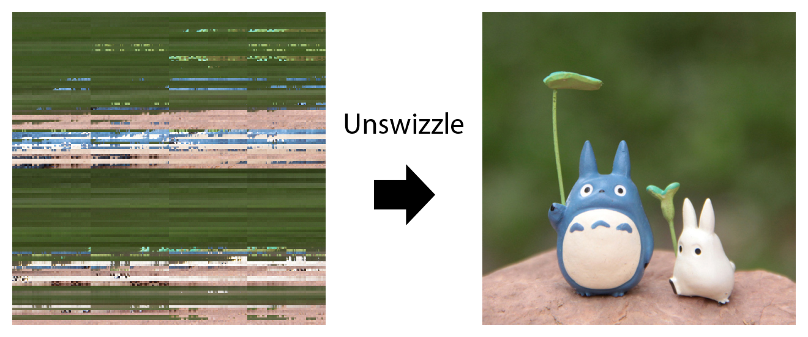

# matlab-texture-unswizzler
Quick MATLAB implementation of a texture unswizzler.

> This is a commission for my lifetime best friend RaúlDJ, to whom I owe a great lot and who has been struggling against this conundrum for a while.

## Usage
1. Put your swizzled BMP files under the `swizzled` directory.
2. Run the script `runme.m`.
3. Each BMP found inside `swizzled` will be unswizzled into the `unswizzled` directory.
4. Enjoy your unswizzled textures!

## Example
